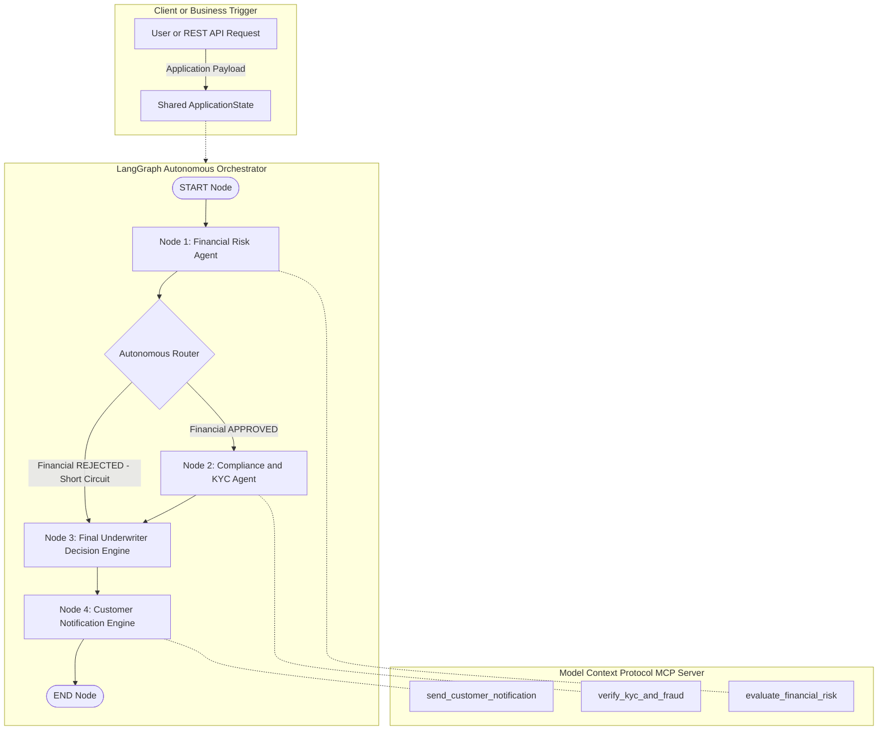

# 🚀 Business Orchestration with Autonomous Agentic Workflows & Model Context Protocol (MCP)

> **Real-Time Business Use Case**: Autonomous Credit Card Approval & Underwriting Engine  
> **Tech Stack**: LangChain | LangGraph | FastMCP | Google Gemini 3.5 Flash-Lite | FastAPI | Pydantic

---

## 📌 Executive Summary

Welcome to the **Agentic AI Business Orchestration Workshop**! 

This repository provides a complete, production-grade demonstration of how modern enterprises build autonomous, tool-using, multi-agent AI systems for real-time business operations. Using a **Credit Card Application & Issuance Pipeline** as the business context, this workshop walks you through **3 foundational Agentic Design Patterns**, progressing from single-agent reasoning loops to decoupled Model Context Protocol (MCP) server architectures with autonomous graph-based routing.

---

## 🎯 Workshop Objectives & Core Agentic Patterns

In this workshop, you will explore and execute 3 distinct agentic design patterns:

| Pattern | Module File | Description | Core Technology |
| :--- | :--- | :--- | :--- |
| **1️⃣ ReAct Pattern** | [`src/agentic_workflow/react_agent.py`](src/agentic_workflow/react_agent.py) | **Single Agent with Tool Use**: Reasoning + Action loop where a single LLM agent dynamically selects and executes Python tools based on observations. | LangChain ReAct + Gemini |
| **2️⃣ Supervisor Pattern** | [`src/agentic_workflow/multi_agent.py`](src/agentic_workflow/multi_agent.py) | **Multi-Agent Collaboration**: Hierarchical Leader-Specialist pattern. A Lead Supervisor orchestrates domain-specific sub-agents (Financial Risk, Compliance/KYC) wrapped as tools. | Agent-as-a-Tool Delegation |
| **3️⃣ Agentic Workflow Orchestrator** | [`src/agentic_workflow/agentic_workflow.py`](src/agentic_workflow/agentic_workflow.py)<br>[`src/agentic_workflow/mcp_server.py`](src/agentic_workflow/mcp_server.py)<br>[`src/agentic_workflow/agentic_workflow_mcp.py`](src/agentic_workflow/agentic_workflow_mcp.py) | **Multi-Agent Autonomous Workflow with MCP Tools**: Stateful DAG workflow with **Autonomous Short-Circuit Routing** connected to a decoupled **FastMCP Server** exposing business tools over stdio/HTTP transport. | LangGraph `StateGraph` + FastMCP + `langchain-mcp-adapters` |

---

## 🏗 System Architecture & Workflow Diagram

### Multi-Agent Autonomous Graph Workflow with FastMCP Tool Decoupling



---

## 🧩 Deep Dive into the 3 Agentic Patterns

### 1️⃣ Pattern 1: ReAct Pattern (Agent with Tool Use)
- **Concept**: Combines **Reasoning** (chain-of-thought planning) and **Acting** (executing function tools). The agent inspects tool outputs (observations) to decide the next step.
- **Business Demonstration**:
  1. *Inventory & Pricing*: Query stock availability and calculate total order price.
  2. *Credit Card Eligibility*: Check applicant parameters (income, credit score, loan amount, age) and invoke issuance / customer notification tools.
- **Code Reference**: [`src/agentic_workflow/react_agent.py`](src/agentic_workflow/react_agent.py)

### 2️⃣ Pattern 2: Supervisor Pattern (Multi-Agent with Tool Use)
- **Concept**: A primary **Supervisor LLM Agent** manages specialist agents. Each specialist agent (e.g., Financial Risk Specialist, Compliance/KYC Specialist) is encapsulated into an **Agent-as-a-Tool** function wrapper.
- **Business Demonstration**:
  - `Supervisor Agent`: Receives high-level application request -> calls `consult_financial_agent()` tool -> calls `consult_compliance_agent()` tool -> synthesizes findings -> calls `notify_customer()` tool.
- **Code Reference**: [`src/agentic_workflow/multi_agent.py`](src/agentic_workflow/multi_agent.py)

### 3️⃣ Pattern 3: Agentic Workflow Orchestrator Pattern (Autonomous Workflow + MCP)
- **Concept**: Stateful Graph-based DAG orchestration using LangGraph. Decouples business logic tools into a standalone **Model Context Protocol (MCP)** server built with `FastMCP`.
- **Autonomous Conditional Short-Circuiting**:
  - If an applicant fails the Financial Risk assessment (e.g., credit score < 600 or income < $30,000), the **Autonomous Router** (`route_after_financial`) immediately **short-circuits** the workflow to Node 3 (Decision Engine), bypassing Node 2 (Compliance/KYC).
  - *Business Benefit*: Reduces overall pipeline execution latency, cuts LLM token costs, and eliminates unneeded background checks for unqualified leads.
- **MCP Decoupling**:
  - `src/agentic_workflow/mcp_server.py`: Runs a standalone FastMCP server `CreditCardServices`.
  - `src/agentic_workflow/agentic_workflow_mcp.py`: Connects via `stdio_client`, dynamically discovers tools via `load_mcp_tools`, and executes graph nodes asynchronously.
- **Code References**:
  - FastMCP Server: [`src/agentic_workflow/mcp_server.py`](src/agentic_workflow/mcp_server.py)
  - Native LangGraph Workflow: [`src/agentic_workflow/agentic_workflow.py`](src/agentic_workflow/agentic_workflow.py)
  - MCP-Integrated Workflow: [`src/agentic_workflow/agentic_workflow_mcp.py`](src/agentic_workflow/agentic_workflow_mcp.py)

---

## ⚡ Additional Production Modules

### 🌐 1. FastAPI REST API Server
Wraps the LangGraph Credit Card Approval Workflow into an enterprise REST API endpoint with Pydantic validation and health probes.
- **File**: [`src/agentic_workflow/api_server.py`](src/agentic_workflow/api_server.py)
- **Endpoints**:
  - `GET /health`: Liveness & Readiness checks for Kubernetes / AWS ECS.
  - `POST /api/v1/applications/process`: Asynchronous execution of the agentic workflow.

### 📊 2. Workflow Evaluation & Benchmarking Engine
Programmatically benchmarks workflow performance against ground-truth evaluation datasets.
- **File**: [`src/agentic_workflow/workflow_eval.py`](src/agentic_workflow/workflow_eval.py)
- **Key Metrics Evaluated**:
  - **Underwriting Decision Accuracy (%)**
  - **Short-Circuit Router Accuracy (%)**
  - **Average Execution Latency (seconds/run)**

### 🔍 3. Agentic Workflow Observability & LangSmith Tracing
Provides enterprise-grade trace visibility into DAG graph node execution, tool calls, Gemini LLM prompts/completions, latencies, and dynamic short-circuit router decisions.
- **File**: [`src/agentic_workflow/agentic_workflow.py`](src/agentic_workflow/agentic_workflow.py)
- **Features**:
  - **LangSmith Tracing Integration**: Zero-code telemetry via standard environment variables (`LANGCHAIN_TRACING_V2=true`).
  - **Node & Tool Instrumentation**: `@traceable` annotations on nodes (`node_financial_agent`, `node_compliance_agent`, etc.) and business tools (`evaluate_financial_risk`, `verify_kyc_and_fraud`).
  - **Rich Metadata & Run Tagging**: Generates structured run tags (`credit-card-approval`, `credit-score-tier-700`) and metadata (`customer_id`, `applicant_name`, `income`) per workflow invocation.
  - **Local Logging Fallback**: Automatically prints structured node spans and execution times locally if LangSmith credentials are not set.

---

## 📁 Repository Directory Structure

```
AGENTIC_WORKFLOW_MCP/
├── .env                       # Environment configuration (git-ignored)
├── .env.example               # Template for environment variables
├── .gitignore                 # Standard Python gitignore rules
├── requirements.txt           # Project dependencies
├── README.md                  # Workshop documentation
└── src/
    ├── __init__.py            # Root package initialization
    └── agentic_workflow/      # Core Agentic AI Business Orchestration Package
        ├── __init__.py        # Package versioning & exports
        ├── react_agent.py     # Pattern 1: ReAct Agent implementation
        ├── multi_agent.py     # Pattern 2: Supervisor Multi-Agent system
        ├── agentic_workflow.py# Pattern 3: LangGraph stateful workflow
        ├── mcp_server.py      # FastMCP standalone tools server
        ├── agentic_workflow_mcp.py # Pattern 3: LangGraph + MCP integration
        ├── api_server.py      # FastAPI REST API wrapper
        └── workflow_eval.py   # Workflow benchmark evaluation engine
```

---

## 🛠 Quickstart & Setup Guide

### Step 1: Prerequisites & Environment Setup
Ensure you have **Python 3.10+** installed. Clone the repository and navigate to the project root.

1. **Create and activate a virtual environment**:
   ```bash
   # Windows (PowerShell)
   python -m venv .venv
   .\.venv\Scripts\Activate.ps1

   # Linux / macOS
   python3 -m venv .venv
   source .venv/bin/activate
   ```

2. **Install project dependencies**:
   ```bash
   pip install -r requirements.txt
   ```

3. **Configure Environment Variables**:
   Copy `.env.example` to `.env` and set your Gemini API key:
   ```bash
   cp .env.example .env
   ```
   Edit `.env`:
   ```env
   GOOGLE_API_KEY=your_actual_gemini_api_key_here
   ```

---

## 🚀 Workshop Hands-On Execution Guide

Follow these steps sequentially to run every stage of the workshop:

### Step 1️⃣: Run Pattern 1 (ReAct Agent)
Execute the single-agent ReAct reasoning & tool invocation demo:
```bash
python src/agentic_workflow/react_agent.py
# or
python -m src.agentic_workflow.react_agent
```
*Expected Output*: Console trace showing `[USER]`, `[REASONING & ACTION]`, `[OBSERVATION]`, and `[FINAL ANSWER]` steps.

---

### Step 2️⃣: Run Pattern 2 (Supervisor Multi-Agent Pattern)
Execute the multi-agent supervisor collaboration workflow:
```bash
python src/agentic_workflow/multi_agent.py
# or
python -m src.agentic_workflow.multi_agent
```
*Expected Output*: The Lead Supervisor agent invoking `consult_financial_agent`, `consult_compliance_agent`, and `notify_customer` tools to process applicant Ayush.

---

### Step 3️⃣: Run Pattern 3 (Native Stateful LangGraph Workflow)
Execute the stateful graph orchestrator with autonomous conditional routing:
```bash
python src/agentic_workflow/agentic_workflow.py
# or
python -m src.agentic_workflow.agentic_workflow
```
*Expected Output*: 
- **Test Case 1 (Eligible)**: Traverses Node 1 -> Node 2 -> Node 3 -> Node 4.
- **Test Case 2 (Ineligible - Credit Score 520)**: Autonomous Router logs:  
  `-> Financial Risk Failed! Short-circuiting workflow directly to Final Decision.` (Node 2 skipped).

---

### Step 4️⃣: Run Pattern 3 with Model Context Protocol (FastMCP)
Execute the complete decoupling pattern where LangGraph dynamically connects to FastMCP via stdio transport:
```bash
python src/agentic_workflow/agentic_workflow_mcp.py
# or
python -m src.agentic_workflow.agentic_workflow_mcp
```
*Expected Output*:
```text
Connecting to MCP Server ...
MCP Session Initialized!
Discovered MCP Tools: ['evaluate_financial_risk', 'verify_kyc_and_fraud', 'send_customer_notification']
...
[WORKFLOW NODE 1 - MCP]: Financial Risk Agent running...
 -> MCP Financial Tool Output: FINANCIAL_STATUS: APPROVED ...
```

---

### Step 5️⃣: Launch Production FastAPI REST Server
Start the production Uvicorn server:
```bash
python src/agentic_workflow/api_server.py
# or
python -m src.agentic_workflow.api_server
```
The API server will launch at `http://localhost:8000`.

- **Swagger Documentation**: Open [http://localhost:8000/docs](http://localhost:8000/docs) in your browser.
- **Test Application via curl**:
  ```bash
  curl -X POST "http://localhost:8000/api/v1/applications/process" \
       -H "Content-Type: application/json" \
       -d '{
             "applicant_name": "Ayush Kumar",
             "customer_id": "ID-998811",
             "income": 65000.0,
             "credit_score": 720,
             "loan_amount": 4000.0,
             "employment_type": "Salaried"
           }'
  ```

---

### Step 6️⃣: Run Automated Workflow Benchmark Evaluation
Run the evaluation suite against ground-truth datasets:
```bash
python src/agentic_workflow/workflow_eval.py
# or
python -m src.agentic_workflow.workflow_eval
```
*Expected Output*:
```text
==================================================
--- EVALUATION BENCHMARK SUMMARY REPORT ---
==================================================
Total Test Cases Evaluated   : 4
Underwriting Decision Accuracy: 100.0%
Short-Circuit Router Accuracy : 100.0%
Average Execution Latency    : 2.15 seconds/run
==================================================
```

---

## 💡 Key Architecture Takeaways for Enterprise Engineers

1. **Why Model Context Protocol (MCP)?**
   - **Decoupling**: Business tools live in isolated services (`FastMCP`) independent of the agent framework or LLM provider.
   - **Reusability**: The same FastMCP tools can be reused by Claude, Gemini, ChatGPT, or custom LangGraph clients without code duplication.

2. **Why LangGraph for Business Orchestration?**
   - Standard LLM chains are static. LangGraph provides **durable state persistence**, **dynamic graph routing**, and **deterministic short-circuiting** essential for complex financial workflows.

3. **Why Continuous Evaluation Benchmarks?**
   - Non-deterministic LLMs require rigorous testing. Automated evaluation ensures that routing logic, decision accuracy, and SLA latency targets are consistently met before deploying to production.

---

## 📄 License & Attribution

Created for the **Autonomous Agentic AI & MCP Business Orchestration Workshop**. Built with [LangChain](https://www.langchain.com/), [LangGraph](https://www.langchain.com/langgraph), [FastMCP](https://github.com/jlowin/fastmcp), and Google Gemini.
